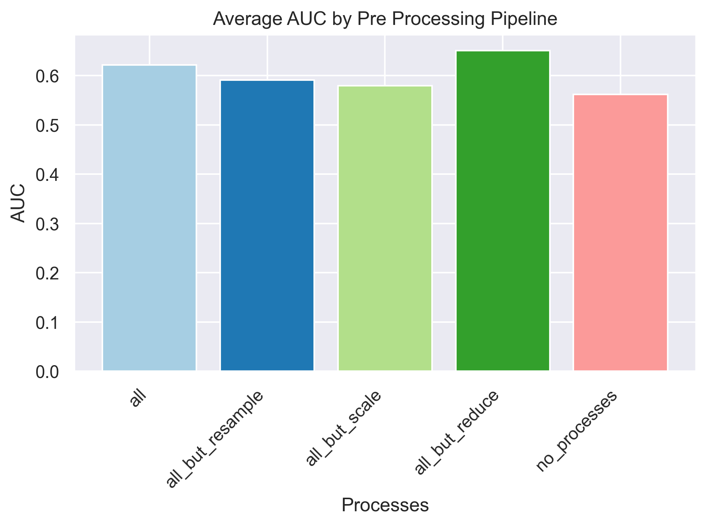

# Executive Summary

For this exercise, I chose to build a flexible and adaptable modeling framework for our dataset. I decided to focus more on the programmatic framework design, than building the optimal model. My approach had 4 phases. Below are the key takeaway from each phase:

* **Phase 0**:  First, I focused on the initial data exploration - during which I found that while mostly clean, the data did have some redundancies, and some skewed distribution that could benefit from scaling. It did have some missing data that would require imputing. 
* Phase 1: I then built a programmatic and flexible process to transform the data, allowing toggling on and off certain data processes. This became particularly helpful in the final testing phase and in the future can be leverage to find a more optimal model

* **Phase 2**: With this pre processing pipeline in place, I then built a full fledged , explainable modeling framework - from training to validation and testing. I was able to obtain a validation **AUC** of **0.72** but only a test AUC of **0.57**.
  

This phase also revealed that some of the key predictors of defaulting are `CurrentBalance`, `OverdraftTotal`, `AverageMonthlyDiscretionarySpend` and allows for a breakdown of individual prediction:

* **Phase 3**: I then ran a series of tests using both my flexible frameworks to find an optimal configuration of data pre processing. However, this can be expanded to tell a multitude of other aspects, such as feature selection, engineering, model selection and so on. The basic test I ran below reveals that the most impactful selection of data pre processing, does not require feature reduction:
  

# What would I do next?

* First I would focus on fully implementing my frameworks to allow even more flexibility in encoders/scalers selection, and other data pre processing
* I would also spend a lot more time analyzing the data with an SME and extracting new features
* I would also want to further explore any bias that may exists in the data - some correlations, while intuitive, may have some adverse impact on certain demographics. For example, `AverageMonthlyDiscretionarySpend` could be an important model feature, but there is a lot of research linking financial discipline to cultural background. So I would definitely want to be a lot more careful about building a productionized model directly around this dataset.