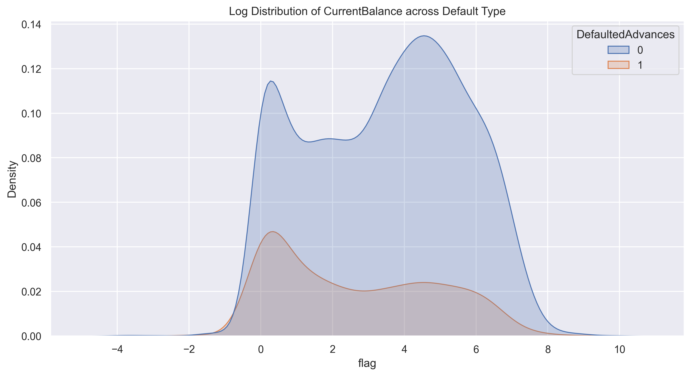

# Summary of Data Exploration

The initial data exploration served mostly to familiarize myself with the data as well as answer some basic questions before I move on the modeling stage, such as:

* How much pre processing/cleaning do we need to do on the data?
* Is the data distribution and representation problematic (i.e., are there a lot of outliers that could skew our results?)
* What are some of the obvious relationships that present themselves?

Given these overarching goals, here were the main findings:

1) While the data is fairly clean, there were a few redundant columns. These could potentially create a lot of multicollinearity later on and will need to be accounted for.
2) A few variables have null values. Of note `CurrentBalance` has over a 25% null rate - this could require some imputation prior to modelling. However, the type of imputation will have to be a consideration given some of the bimodal patterns observed within `CurrentBalance`
3) Some features were univariate and could be considered redundant for modelling purposes, and removed.
4) Most of the numeric variables have reasonable distributions, but we still have some skewness and outlier presence that would likely require some scaling
5) There is a fairly low default rate which may require some resampling prior to modelling
6) There does not appear to be major/obvious correlations between default rates and the existing features, but the broad relationships observed are intuitive and it is likely that some non linear combinations will emerge during the modelling

# More Details on Exploration

## Data Redundancies & Conceptual Uncertainties

One of the first data concerns that showed up is the redundancy in feature. Sometimes the same feature would appear twice under different name, but would have the exact same composition, or nearly identical.

Other cases where the differences were very minimal or zero, were across the following pairs:
* `LatefeesTotalCount`, `LatefeesCount`
* `AverageNumberOfTransactionsADay`, `AverageNumberOfTransactionsADayPrimaryChecking`

However, there were much less obvious cases. There are 3 variables in the dataset that appear to indicate some level of income, namely:

* `Paycheck`
* `AverageMonthlyIncome`
* `AveragePotentialMonthlyIncome`

The relationship between those three was not clear, but they all seem correlated to some extend. The main differentation was that `AveragePotentialMonthlyIncome` seemed to have two modes of distribution - one around 0, and one around $300-$500 (as seen from the separation of two clusters below) but within those modes, the relationships between itself and the other two variable were not intuitive.

This uncertainty in conceptual understanding might have some impact on the final result. In a less constrained environment, I would want to have more conversations with subject matter experts and further understand these variables. If there were still uncertainties after that point, I would implement a more rigorous feature selection process for these variables specifically.

## Null Rates

The following variables had a non zero null rate:

* `CurrentBalance` (26%)
* `NumberOfMatches` (28%)
* `ErrorRate` (28%)
* `IsNameBased` (28%)

The last 3 features all pertain to the ML models used to identify paychecks. They have very low associations with the default rate and other variables across the dataset and would likely end up being removed from the analysis, so their high null rates could not matter.

(Note that this is an educated guess that I am making based on preliminary analysis, but additional tests during the modeling stage may reveal otherwise)

While `CurrentBalance` also only exhibits some weak associations with the default rate, intuitively, it would seem like a good candidate for non linear relationships to the rate. So the high amount of null values in that column is concerning.

Once again, this is something that will be tested later on in the modelling stage. But the bimodal tendencies of this variable (shown below) would seem to indicate that a simple mean or median imputatino for null values may not be good enough, should this variable be important.

This is because the distribution of non defaulted and defaulted appear to be slighlty different with the bimodal aspect of the non defaulted records being much more pronounced. So this could in theory require a more complex imputation, since a simple mean imputation could introduce some bias.

## General Patterns

As mentioned in the summary, there were no obvious patterns with the default rate that emerged. That is to say that no single feature demonstrated a strong correlation with the default rate. However, as seen in the distribution chart below, some of the high level patterns that emerge are very intuitive. And this could indicate that while standalone features may not be perfect predictors, perhaps some non linear combinations might work.

