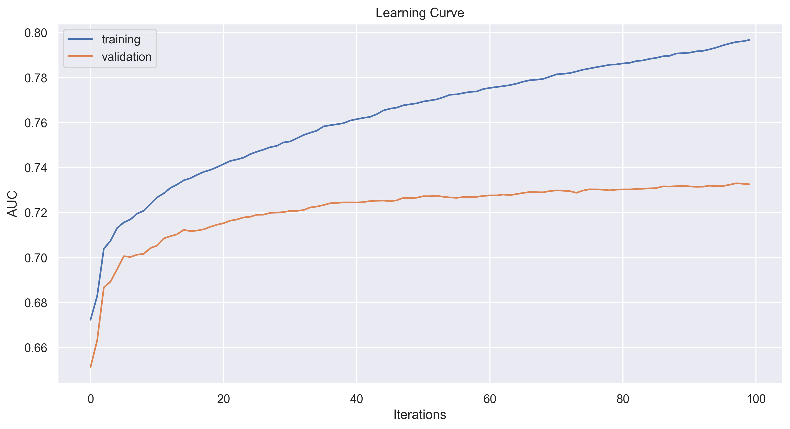
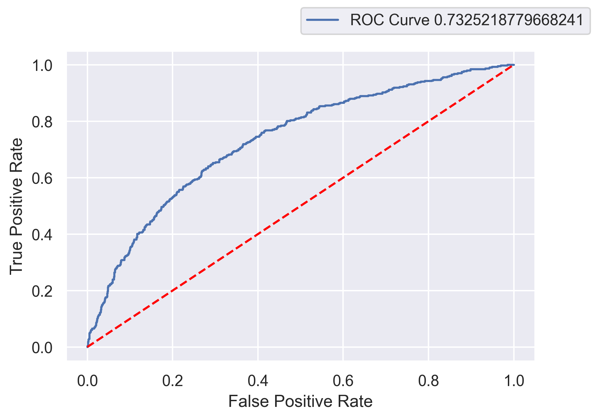
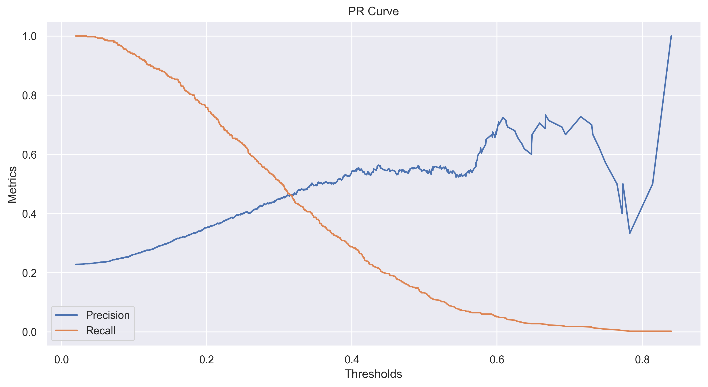
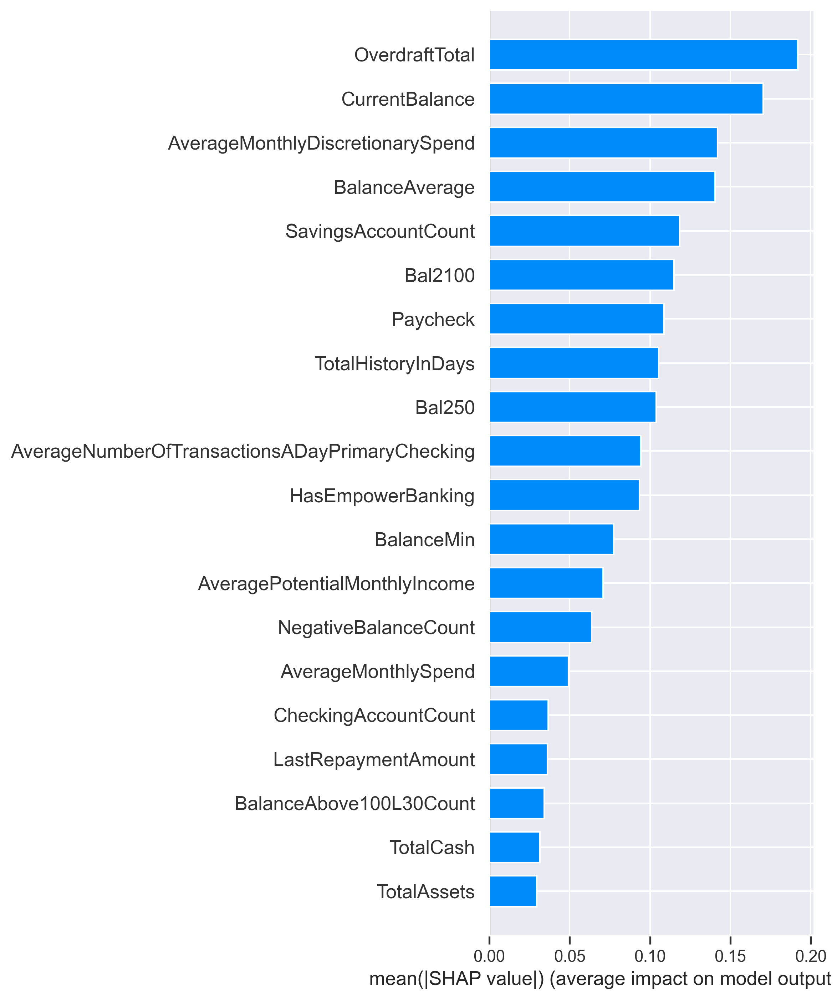
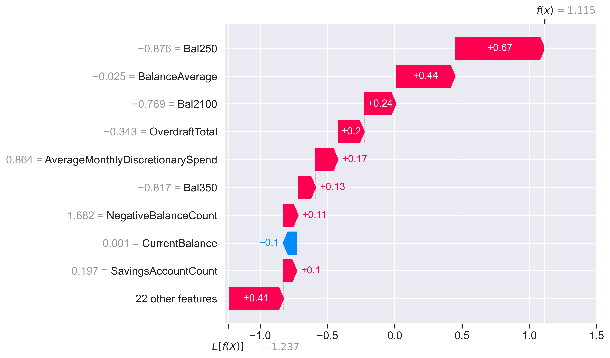

# Summary

I have created a framework that allows for a flexible modeling process. The framework only requires the data process pipeline from the previous phase, as well as a set of hyperparameters to tune the model on. With those two parameters, it will go through training, validation and testing, producing relevant artefacts throughout. It also has built-in explainability through SHAP.

Note that during this exercise, I focused more on the process rather than the results. So the results below are suboptimal.

* Validation AUC of 0.83 and Test AUC of 0.65
* Precision and Recall at optimal threshold revolved around ~42%
* The most impactful features were: `feature1`, `feature1`, `feature1`

# Detailed Process

## Pre Processing

The framework requires a data processing pipeline, detailed in the previous phase

## Training and Hyperparameter Tuning

Once the data has been processed, we can start training and tuning. I used an XGBoost model with a GridSearch. With more time, I would have likely implemented a Bayesian Optimization process to replace the random grid search.

The grid search will be conducted on the training data, and will output a set of parameters that have produced the best AUC over the k-fold cross validation of the training set. Those parameters are then passed to the next stage.

## Validation

Using the optimal parameters obtained, I re instantiate a model, train it on the training set and validate is on the validation set. The following validations were done:

**Learning Curves**

This allowed me to understand if any learning and/or overfitting was happening. In this case, it does look like we're overfitting on the training set and that we don't need that many iterations. However, this does not seem to have a high adverse impact on the validation score

**AUC Curve**

We can see from the curve below that our model has an AUC of 0.71. This is a high level metric that gives us confidence that, at a randomly picked threshold, our model will have a good probability of properly classifying a defaulted case.

**PR Curve**

The PR curves allows us to determine the optimal threshold we need to use for predictions. This threshold can be picked to maximize both precision and recall, or one at the expense of the other, depending on the business case. 

## Testing

Now that we have validated our model and chosen an optimal threshold, we can apply this threshold to the te st set to gauge the true performance of the model. On the test set, our final AUC is 0.65, with a precision and recall rate of roughly ~40%.

## Explainability

Using SHAP values, we are also able to get some insights as to what variable matters the most. At a high level, we see that `CurrentBalance`, `OverdraftTotal`, `AverageMonthlyDiscretionarySpend` are the most impactful features towards determining whether someone will default.

We can also have some more user level insight as to how a given prediction is made:

