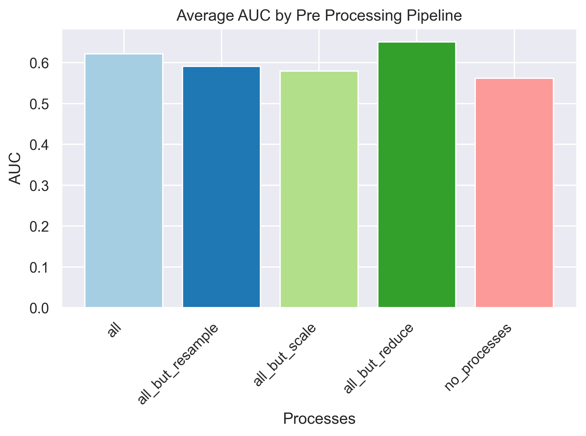

# Summary

To demonstrate how the framework that I have built can be helpful, I have shown below how I used them to test the performance of the model under several different pipeline approaches. The test suite can be further expanded as the data process pipeline is extended.

